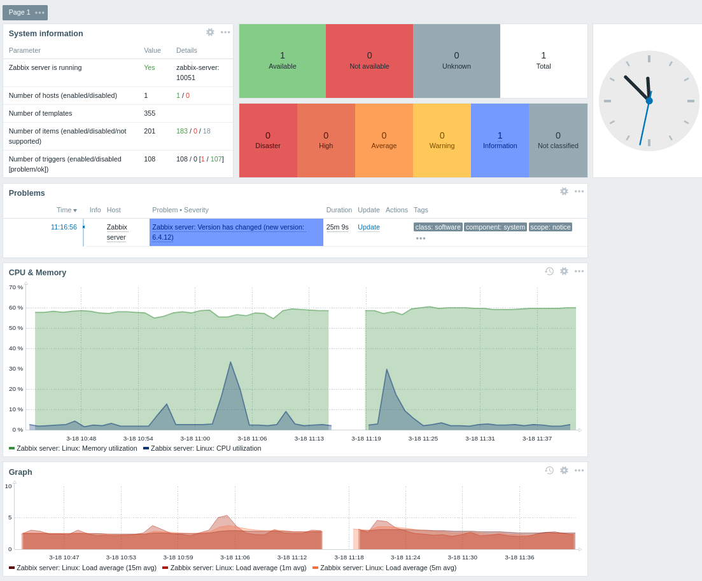
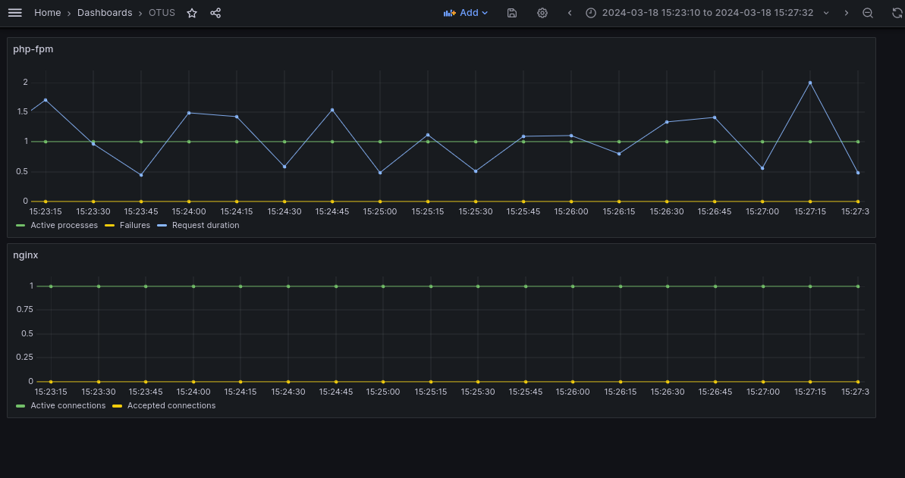

# Мониторинг
## Zabbix
Для мониторинга "железных" метрик был установлен Zabbix через Docker.
Были развернуты контейнеры:
* zabbix-server - сервер zabbix
* timescaledb - бд для хранения метрик
* zabbix-agent - агент для сбора метрик и передачи на сервер
* zabbix-web - web-интерфейс для мониторинга (хотелось конечно подключить интеграцию в garafana, но плагин не работает с новыми версиями Zabbix)
В web-интерфейсе был настроен хост и созданы дашборды (CPU & Memory utilization, load average, ...):

## Prometheus

Был поднят контейнер prometheus. Для сбора метрик по методологии RED были подняты экспортеры для выгрузки метрик из php-fpm (hipages/php-fpm_exporter) и nginx (nginx/nginx-prometheus-exporter). Экспортеры выгружают метрики, а prometheus их подхватывает.

## Grafana

Также был развернут контейнер с grafana. В нем организован дашборд с метриками nginx и php-fpm из prometheus. Из nginx вытаскиваются и аггрегируются метрики:
* Кол-во активных соединений
* Кол-во обработанных запросов

Из php-fpm:
* Кол-во активных процессов
* Кол-во ошибок
* Длительность обработки

